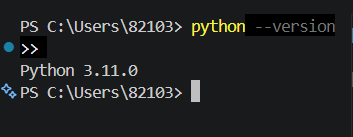
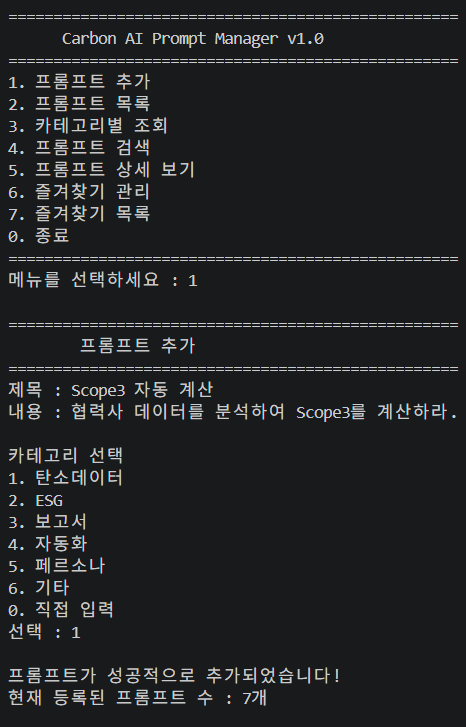
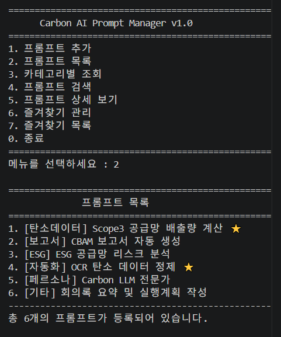
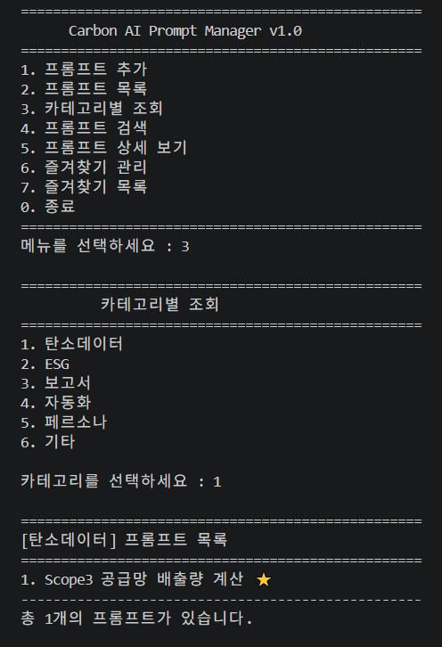
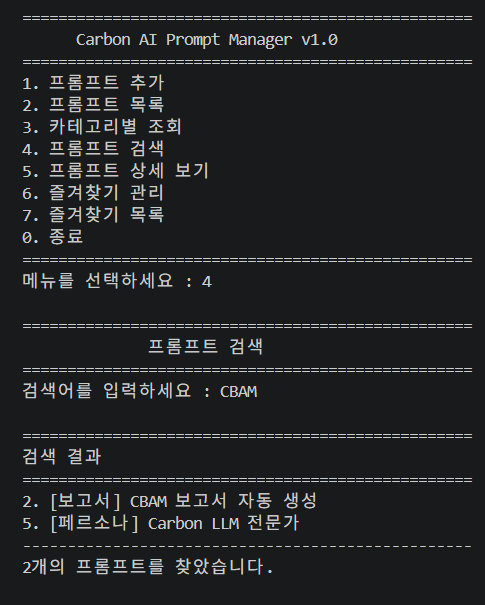
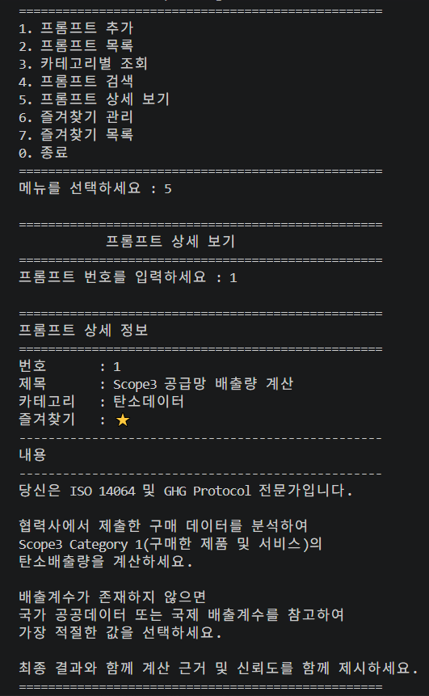
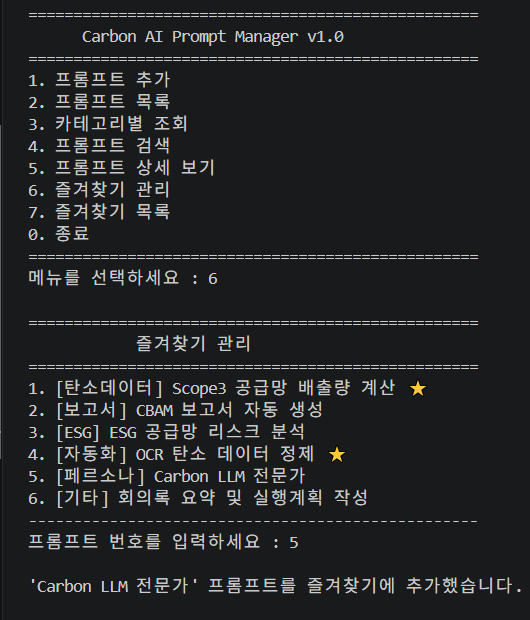
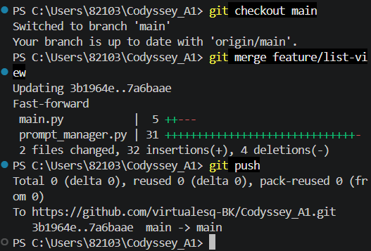

# 컴퓨터에게 명령하는 말(파이썬) 처음 배우고 작업 이력 남기기

# Carbon AI Prompt Manager

Python으로 개발한 콘솔(Console) 기반 프롬프트 관리 프로그램입니다.

사용자가 다양한 AI 프롬프트를 등록하고, 조회하고, 검색하며, 즐겨찾기로 관리할 수 있습니다.

본 프로젝트는 Python의 기본 자료구조(List, Dictionary), 함수(Function), 반복문, 조건문을 활용하여 구현하였으며, Git과 GitHub를 이용한 버전 관리 및 브랜치 전략을 함께 학습하기 위해 제작되었습니다.

---

# 프로젝트 구조

```
Codyssey_A1
│
├── main.py                # 메인 프로그램
├── data.py                # 기본 프롬프트 데이터
├── prompt_manager.py      # 프롬프트 관리 기능
├── utils.py               # (예비) 공통 함수
├── README.md
└── .gitignore
```

---

# 개발 환경

- Visual Studio Code

### 코드 에디터(VS Code)에서 Python 설치 확인(Hello) 스크린샷

에서 Python 설치 확인(Hello).png)

- Python 3.11.0

### 터미널에서 Python 버전 확인 스크린샷



- Git
- GitHub

### GitHub 계정 연결 상태 확인 (VS Code 앱 연동) 스크린샷

.png)


---

# 실행 방법

### 1. 저장소 복제

```bash
git clone https://github.com/virtualesq-BK/Codyssey_A1.git
```

### 2. 프로젝트 폴더 이동

```bash
cd Codyssey_A1
```

### 3. 프로그램 실행

```bash
python main.py
```

또는

```bash
python3 main.py
```

---

# 프로그램 메뉴

```
==================================================
      Carbon AI Prompt Manager
==================================================

1. 프롬프트 추가
2. 프롬프트 목록
3. 카테고리별 조회
4. 프롬프트 검색
5. 프롬프트 상세 보기
6. 즐겨찾기 관리
7. 즐겨찾기 목록
0. 종료
```

---

# 주요 기능

## 1. 프롬프트 추가

- 제목 입력
- 내용 입력
- 카테고리 선택
- 새로운 프롬프트 등록

### 메뉴 화면 및 프롬프트 추가 스크린샷



---

## 2. 프롬프트 목록

등록된 모든 프롬프트를 출력합니다.

출력 정보

- 번호
- 카테고리
- 제목
- 즐겨찾기 여부(⭐)

### 프롬프트 목록 스크린샷



---

## 3. 카테고리별 조회

선택한 카테고리에 속한 프롬프트만 조회합니다.

### 카테고리별 조회 스크린샷



---

## 4. 프롬프트 검색

키워드를 입력하면

- 제목
- 내용

에서 검색하여 결과를 출력합니다.

(대소문자를 구분하지 않습니다.)

### 프롬프트 검색 스크린샷



---

## 5. 프롬프트 상세 보기

선택한 프롬프트의

- 제목
- 카테고리
- 즐겨찾기
- 전체 내용

을 출력합니다.


### 프롬프트 상세 보기 스크린샷



---

## 6. 즐겨찾기 관리

프롬프트를

- 즐겨찾기 추가
- 즐겨찾기 해제

할 수 있습니다.


### 즐겨찾기 추가 스크린샷



---

## 7. 즐겨찾기 목록

즐겨찾기로 등록된 프롬프트만 출력합니다.


### 즐겨찾기 보기(목록) 스크린샷

.png)

---

# 등록된 기본 카테고리

- 탄소데이터
- ESG
- 보고서
- 자동화
- 페르소나
- 기타

---

# 기본 프롬프트

프로그램 시작 시 다음과 같은 기본 프롬프트가 등록되어 있습니다.

- Scope3 공급망 배출량 계산
- CBAM 보고서 자동 생성
- ESG 공급망 리스크 분석
- OCR 탄소 데이터 정제
- Carbon LLM 전문가
- 회의록 요약 및 실행계획 작성

---

# 사용한 Python 기술

본 프로젝트에서는 다음 Python 기능을 활용하였습니다.

- List
- Dictionary
- Function
- if / elif / else
- while
- for
- enumerate()
- 문자열 검색
- Boolean(True / False)
- 모듈 분리(import)

---

# Git 활용

본 프로젝트는 Git을 활용하여 기능 단위로 커밋을 수행하였습니다.

- Init
- Add .gitignore
- Add README.md
- 기본 프롬프트 데이터 등록
- 메뉴 화면 구현
- 프롬프트 추가 기능 구현
- 프롬프트 목록 (브랜치 활용) 구현
- 카테고리별 조회 구현
- 프롬프트 검색 구현
- 프롬프트 상세 보기 구현
- 즐겨찾기 관리 구현


또한 feature 브랜치를 생성하여 목록 기능을 개발한 후 main 브랜치에 병합(Merge)하였습니다.


### 프롬프트 목록(브랜치 활용) 구현 스크린샷

 구현.png)


### main 브랜치로 병합 스크린샷




---

# 향후 개선 사항

- 프롬프트 수정 기능
- 프롬프트 삭제 기능
- JSON 파일 저장
- 프로그램 종료 후 데이터 유지
- 다중 키워드 검색
- 정렬 기능
- 사용자 로그인 기능
- GUI 버전(PyQt 또는 Tkinter)
- 웹 버전(Flask 또는 Django)

---

# 개발자

김병국 

Codyssey AI Python Mission

Developed with Python, Git and GitHub.